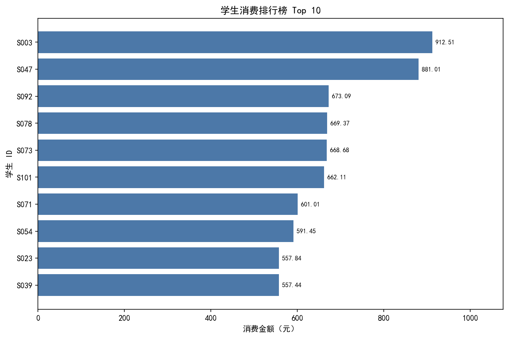
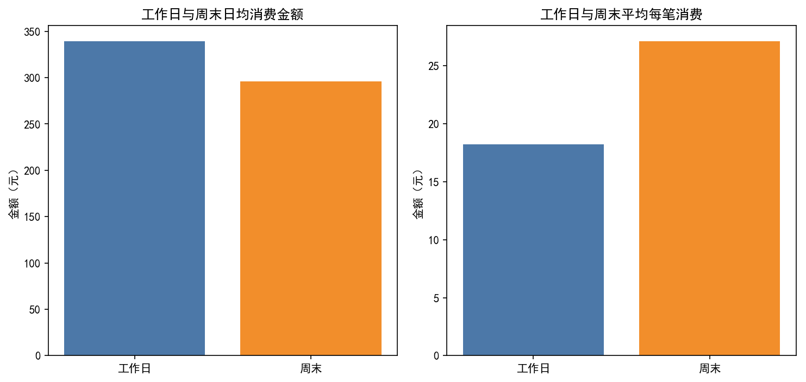
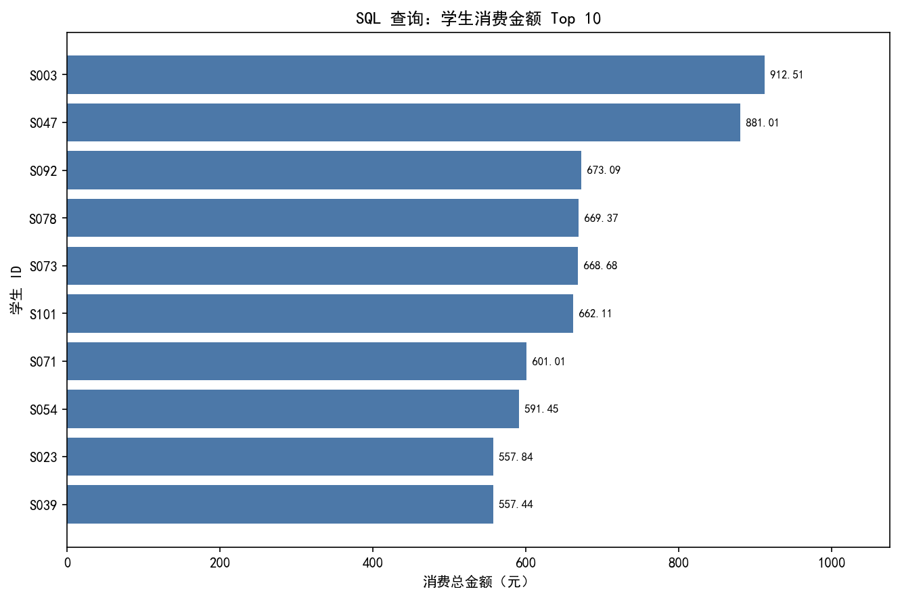
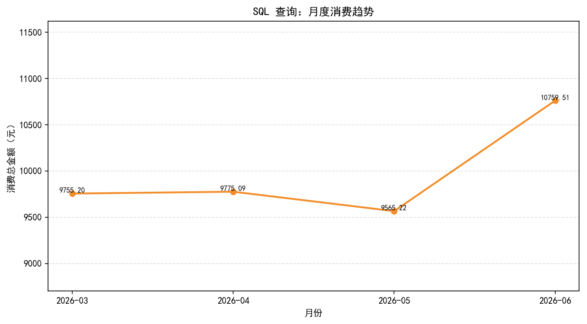

# 校园消费数据分析系统

## 一、项目简介

这是一个兼容 Python 3.7 的校园消费数据分析项目。项目从模拟数据生成开始，依次完成 CSV 存储、数据清洗、SQLite 数据库导入、SQL 聚合查询、Pandas 二次处理、Matplotlib 可视化和自动报告生成。

项目保留了 Pandas 分析路线，同时增加了独立的 SQLite / SQL 分析路线。两条路线会对记录数、总消费金额、消费最高学生和各消费类型金额进行一致性检查。

## 二、技术栈与运行环境

- Python 3.7.0
- pandas 0.23.4
- matplotlib 2.2.3
- SQLite / SQL（Python 标准库 `sqlite3`）
- Git / GitHub

SQLite 不需要安装额外依赖，也没有使用 SQLAlchemy。安装项目依赖：

```bash
python -m pip install -r requirements.txt
```

## 三、数据说明

`generate_data.py` 使用固定随机种子 `20260910` 生成 2000 条、120 名学生的模拟校园消费记录，日期范围为 2026-03-01 至 2026-06-30。

模拟规则包括：

- 工作日消费活跃度高于周末
- 周末增加超市、水果店和体育健身消费倾向
- 期末阶段增加图书文具、打印复印和饮料消费倾向
- 不同学生具有稳定的活跃度、消费水平和支付偏好
- 不同消费类型具有各自的典型金额和合理上下限

`data.csv` 保持以下字段：

- 日期
- 学生ID
- 消费类型
- 消费金额
- 支付方式

升级前的 15 条小型数据保存在 `data_sample_backup.csv`。

本项目使用模拟生成的校园消费数据，仅用于学习和数据分析项目展示，不包含真实学生隐私数据。

## 四、完整数据处理流程

```text
generate_data.py
        ↓
     data.csv
        ↓
      main.py
      ↙    ↘
  Pandas   SQLite 数据库
     ↓          ↓
统计与清洗     SQL 查询分析
     ↓          ↓
     └──→ Pandas DataFrame
                    ↓
               Matplotlib
                    ↓
      analysis_report.txt
      sql_analysis_report.txt
      output/ 下的分析图表
```

`main.py` 是项目总入口。每次运行都会保留并执行第四轮的 Pandas 分析，同时重建 SQLite 表内数据、执行 SQL 查询、生成 SQL 图表和 SQL 报告。

## 五、主要功能

### 1. 数据检查与 Pandas 分析

- 检查字段、缺失值、重复值、日期和金额格式
- 计算记录数、学生数、总消费、均值、中位数和人均消费
- 展示学生消费金额 Top 10
- 分析消费类型、支付方式、每日、月度和星期趋势
- 对比工作日与周末消费
- 生成 `analysis_report.txt` 和原有 8 张图表

### 2. SQLite 数据库存储

`database.py` 使用标准库 `sqlite3`：

- 创建 `campus_consumption.db`
- 创建 `consumption_records` 表和查询索引
- 导入前验证 CSV 字段、日期、金额和空值
- 验证通过后在同一事务中清空旧数据并重新导入
- 重复运行不会不断追加数据
- 提供连接、建表、导入、基础查询和关闭连接函数

数据库表字段：

| 字段 | SQLite 类型 | 说明 |
| --- | --- | --- |
| `id` | INTEGER | 自增主键 |
| `date` | TEXT | 消费日期，格式为 YYYY-MM-DD |
| `student_id` | TEXT | 学生编号 |
| `category` | TEXT | 消费类型 |
| `amount` | REAL | 消费金额，必须大于 0 |
| `payment_method` | TEXT | 支付方式 |

### 3. SQL 分析能力

`sql_analysis.py` 先通过 SQL 完成筛选、分组和聚合，再使用 `pd.read_sql_query()` 转换为 Pandas DataFrame。主要查询包括：

- `COUNT`、`SUM`、`AVG`：数据库概况和消费概况
- `GROUP BY`：学生、消费类型、支付方式、每日和月度汇总
- `ORDER BY` 与 `LIMIT`：消费金额 Top 10、消费次数 Top 10、最高金额记录
- `WHERE amount >= ?`：筛选高额消费记录
- `strftime('%Y-%m', date)`：按月统计
- `strftime('%w', date)` 与 `CASE`：判断工作日和周末

SQL 查询保持简洁，便于学习和面试时逐条解释。

### 4. 自动一致性检查

`main.py` 会自动核对：

- CSV 记录数与 SQLite 表记录数
- Pandas 总消费金额与 SQL `SUM(amount)`
- Pandas 与 SQL 的消费金额 Top 1 学生
- Pandas 与 SQL 的各消费类型总金额

金额统一保留两位小数后比较。如果结果不一致，程序会给出中文错误信息并停止。

## 六、项目结构

```text
campus-consumption-analysis/
├── generate_data.py          # 使用固定随机种子生成模拟数据
├── main.py                   # 项目总入口，运行 Pandas 与 SQL 两条分析流程
├── database.py               # SQLite 连接、建表、CSV 验证和可重复导入
├── sql_analysis.py           # SQL 查询、结果展示、SQL 图表和报告生成
├── data.csv                  # 当前 2000 条模拟校园消费数据
├── data_sample_backup.csv    # 第四轮升级前的小型数据备份
├── campus_consumption.db     # 自动生成的 SQLite 数据库
├── analysis_report.txt       # Pandas 分析自动报告
├── sql_analysis_report.txt   # SQL 查询结果自动报告
├── requirements.txt          # pandas 和 matplotlib 兼容版本
├── README.md                 # 项目说明
└── output/                   # 全部分析图表
    ├── 消费类型统计.png
    ├── 每日消费趋势.png
    ├── 学生消费排行榜.png
    ├── 消费类型占比.png
    ├── 支付方式统计.png
    ├── 工作日周末消费对比.png
    ├── 月度消费趋势.png
    ├── 星期消费分布.png
    ├── sql学生消费Top10.png
    └── sql月度消费趋势.png
```

## 七、运行步骤

在项目目录中依次执行：

```bash
python generate_data.py
python main.py
```

`python generate_data.py` 会用固定随机种子重新生成 `data.csv`。

`python main.py` 会依次完成：

1. CSV 读取和数据清洗
2. Pandas 统计分析
3. 原有 8 张图表和 `analysis_report.txt`
4. SQLite 数据库更新
5. SQL 查询与 Pandas DataFrame 转换
6. 两张 SQL 图表和 `sql_analysis_report.txt`
7. CSV、Pandas 与 SQL 一致性检查

也可以单独运行数据库或 SQL 模块：

```bash
python database.py
python sql_analysis.py
```

## 八、图表展示

### Pandas 学生消费排行榜



### 工作日与周末消费对比



### SQL 学生消费 Top 10

该图的数据来自 SQL 的 `GROUP BY`、`ORDER BY` 和 `LIMIT 10` 查询结果。



### SQL 月度消费趋势

该图的数据来自 SQL 使用 SQLite 日期函数完成的月度汇总结果。



## 九、项目特点

- 同一份数据同时经过 Pandas 与 SQL 分析，便于比较两种处理方式
- SQL 负责核心筛选和聚合，不是仅用于存储
- SQL 结果通过 Pandas DataFrame 进入 Matplotlib 可视化
- 数据库采用事务式全量刷新，运行结果稳定且可重复
- 两份报告均根据实际计算结果动态生成，没有硬编码统计数字
- 代码结构保持清晰，适合作为 Python、Pandas、SQLite 和 SQL 综合练习项目
