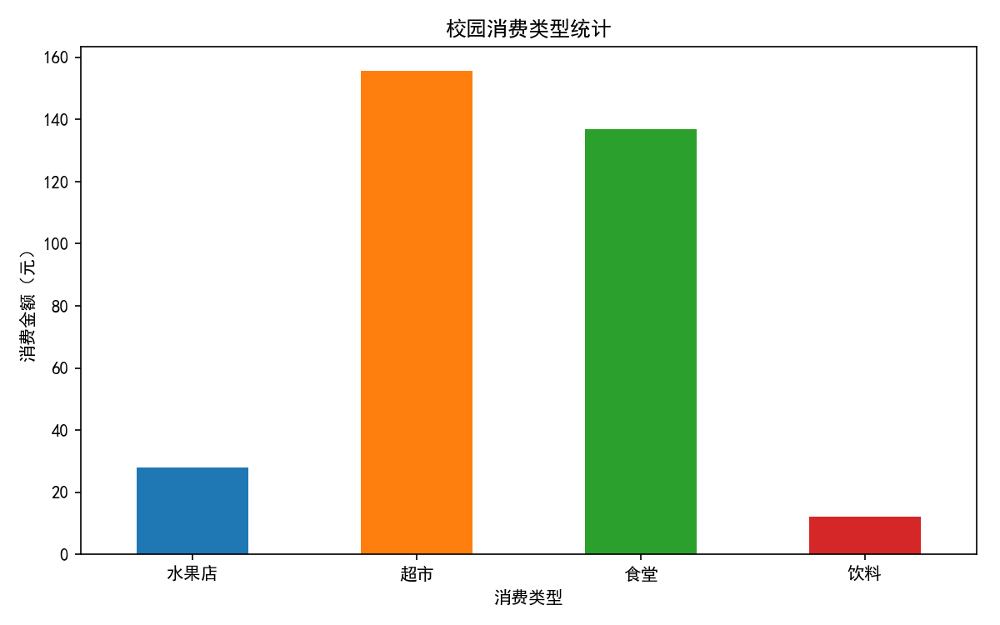
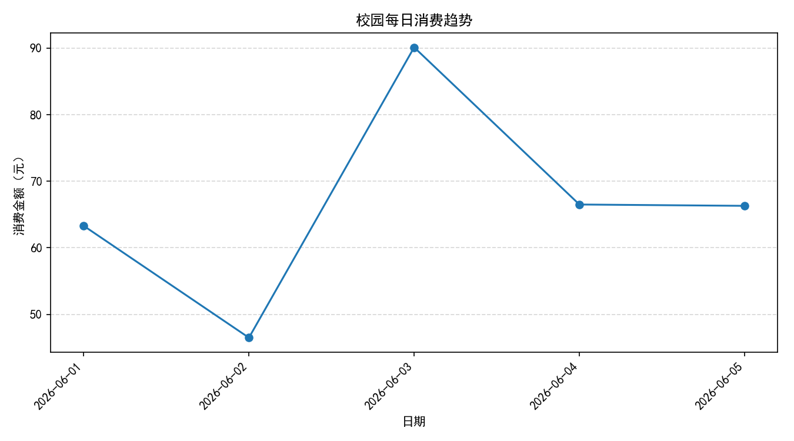
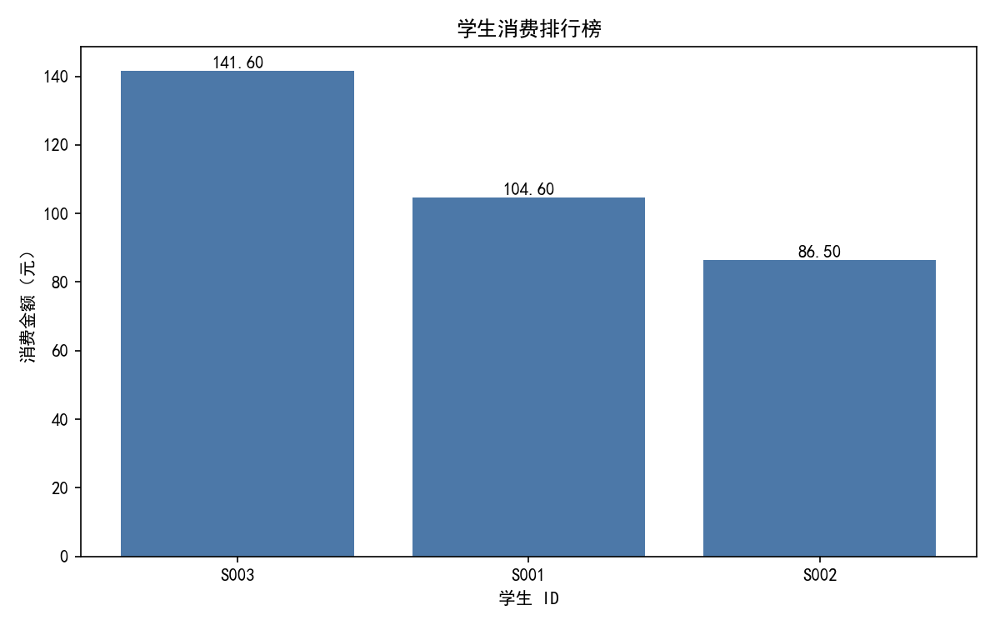
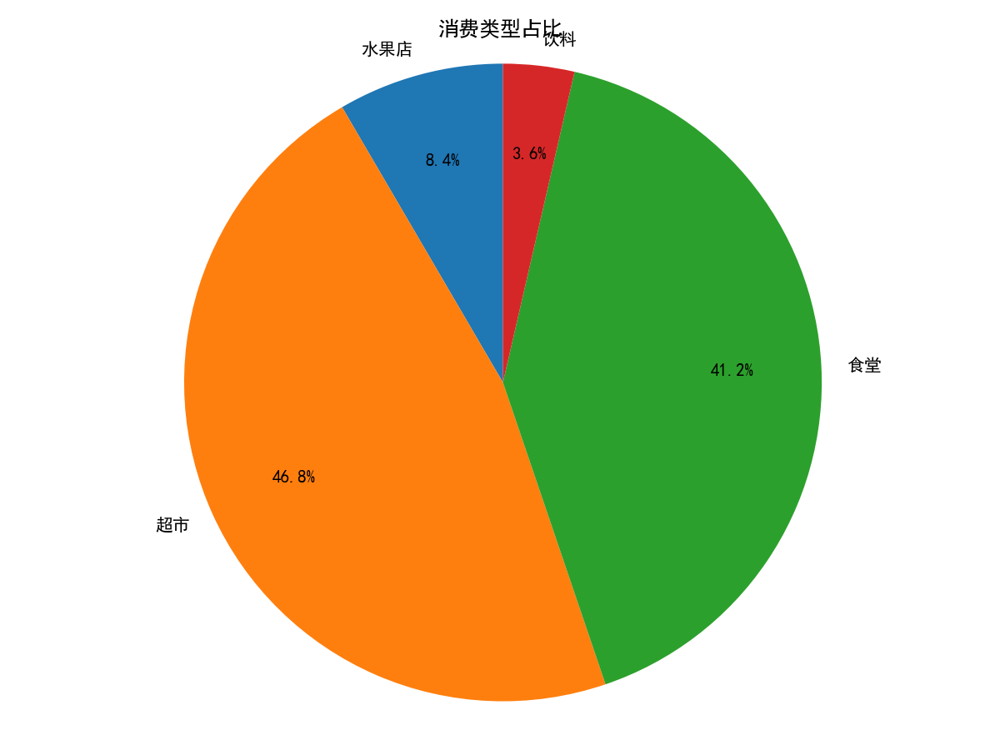
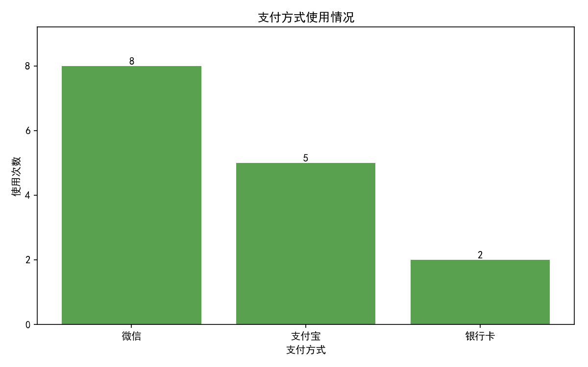

# 校园消费数据分析系统

## 一、项目简介

这是一个基于 Python 的校园消费数据分析项目。程序读取 CSV 格式的消费记录，完成数据检查、清洗、统计分析和可视化，并自动生成中文文字分析报告。

项目适合用于学习 Python 数据分析的基本流程，也可以作为 GitHub 和个人简历中的入门数据分析作品。

## 二、运行环境

- Windows
- Python 3.7.0
- pandas 0.23.4
- matplotlib 2.2.3

项目没有使用其他第三方依赖。

## 三、主要功能

### 1. 数据检查与清洗

- 检查必要字段
- 统计缺失值和重复记录
- 检查消费金额能否转换为数值
- 检查金额小于等于 0 的异常记录
- 检查日期格式
- 合理删除无法参与分析的异常记录

### 2. 基础消费统计

- 消费记录数、总消费金额和平均每笔消费金额
- 单笔最高和最低消费金额
- 各学生消费总金额
- 学生消费金额排行榜
- 消费次数最多的学生，支持并列结果
- 各消费类型的消费金额
- 消费金额最高的学生

### 3. 支付方式分析

- 各支付方式的使用次数
- 各支付方式的消费总金额
- 使用次数最多的支付方式

### 4. 每日消费趋势

- 将日期转换为可排序的日期类型
- 按日期汇总每天的消费金额
- 找出消费金额最高的一天

### 5. 数据可视化

程序运行后会生成：

- 消费类型金额柱状图
- 每日消费趋势折线图
- 学生消费排行榜柱状图
- 消费类型金额占比饼图
- 支付方式使用次数柱状图

### 6. 自动分析报告

程序会根据清洗后的实际数据生成 `analysis_report.txt`，内容包括数据基本情况、整体消费、学生消费、消费类型、支付方式、每日趋势和简单总结。报告中的数字由程序计算，不是手工写死的。

## 四、项目结构

```text
campus-consumption-analysis/
├── main.py                 # 数据清洗、分析、绘图和报告生成
├── data.csv                # 校园消费原始数据
├── README.md               # 项目说明
├── analysis_report.txt     # 自动生成的文字分析报告
├── 消费类型统计.png         # 消费类型金额柱状图
├── 每日消费趋势.png         # 每日消费趋势折线图
├── 学生消费排行榜.png       # 学生消费排行榜柱状图
├── 消费类型占比.png         # 消费类型占比饼图
└── 支付方式统计.png         # 支付方式使用次数柱状图
```

## 五、数据分析流程

```text
读取 CSV 数据
    ↓
检查字段、缺失值、重复值、金额和日期
    ↓
清洗明显异常记录
    ↓
计算基础、学生、类型、支付方式和每日指标
    ↓
输出控制台统计结果
    ↓
生成 5 张图表和文字分析报告
```

## 六、运行步骤

### 1. 安装指定版本依赖

```bash
python -m pip install pandas==0.23.4 matplotlib==2.2.3
```

### 2. 进入项目目录

```bash
cd campus-consumption-analysis
```

### 3. 运行程序

```bash
python main.py
```

程序会在项目目录中生成或更新 5 张 PNG 图表和 `analysis_report.txt`。

## 七、图表展示

### 消费类型统计



### 每日消费趋势



### 学生消费排行榜



### 消费类型占比



### 支付方式统计



## 八、技术要点

- 使用 pandas 完成数据读取、清洗、分组汇总和排序
- 使用 Matplotlib 生成柱状图、折线图和饼图
- 使用动态计算结果生成中文分析报告
- 所有图表分别创建、保存和关闭，避免互相影响
- 使用程序所在目录定位输入和输出文件

## 九、说明

当前仓库使用的是小型示例数据，适合演示完整的数据分析流程。分析结论只针对 `data.csv` 中的当前记录。
